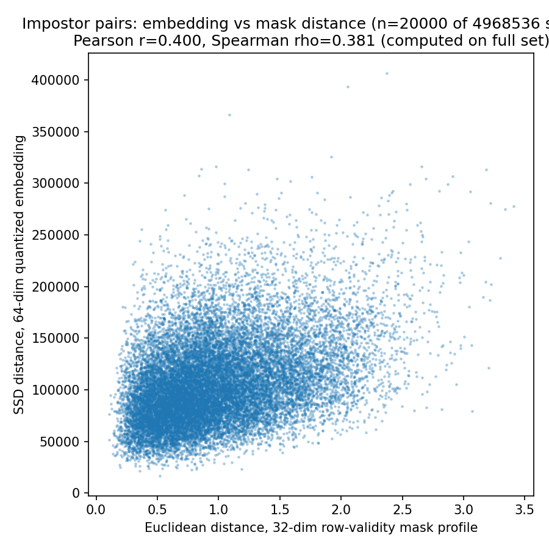

# Mask-geometry leakage audit -- CircularConvEncoder v3

Read-only audit. Same 299-test-identity / 1998-gallery / 2488-de-duplicated-probe protocol as `all_features_nn_testsplit_comparison.json` / `audit_nn_v3_dedup_metrics.json`. Identification metrics only (Recall@K, median rank) -- no EER.

## Reference baseline (unmodified NN v3, quantized)

| | R@10 | R@50 | R@100 | R@300 | MedRank |
|---|---|---|---|---|---|
| NN v3 (unmodified) | 0.7432 | 0.8802 | 0.9285 | 0.9731 | 2.0 |

## Check 1 -- mask-only baseline (no learning)

32-dim per-row mask validity fraction, ranked by SSD (same distance/harness as every other feature). Bounds how much identity information the mask alone carries.

| | R@10 | R@50 | R@100 | R@300 | MedRank |
|---|---|---|---|---|---|
| Mask-only (32-dim) | 0.2432 | 0.4152 | 0.5177 | 0.7239 | 87.0 |
| NN v3 (unmodified) | 0.7432 | 0.8802 | 0.9285 | 0.9731 | 2.0 |

Random-embedding floor for reference: R@10 ~ 0.0050.

**Implication:** the mask-only feature reaches R@10=0.2432 against a ~0.0050 random floor and the NN's 0.7432 -- mask geometry alone carries non-trivial identity information on its own, well short of the learned embedding's performance.

## Check 2 -- mask-channel swap at inference (3 seeds)

Channel 1 (fed to the conv stack) replaced with a different, randomly chosen identity's mask; channel 0 (iris code) and the pooling-stage mask stay TRUE. Isolates the soft-masking (conv) pathway from the hard pooling gate.

| Seed | R@10 | R@50 | R@100 | R@300 | MedRank |
|---|---|---|---|---|---|
| swap seed=0 | 0.1901 | 0.3268 | 0.3931 | 0.5153 | 258.5 |
| swap seed=1 | 0.1893 | 0.3115 | 0.3782 | 0.5105 | 279.5 |
| swap seed=2 | 0.1889 | 0.3095 | 0.3810 | 0.5305 | 254.0 |
| **mean** | 0.1894 | 0.3159 | 0.3841 | 0.5188 | 264.0 |
| **std**  | 0.0005 | 0.0077 | 0.0065 | 0.0086 | 11.1 |
| baseline (no swap) | 0.7432 | 0.8802 | 0.9285 | 0.9731 | 2.0 |

**Implication:** swapping channel 1 for an uncorrelated identity's mask moves R@10 from 0.7432 (baseline) to 0.1894 (mean over 3 seeds, std 0.0005) -- a substantial drop, indicating real reliance on the soft (conv-stack) masking pathway.

## Check 3 -- embedding distance vs mask distance (impostor pairs only)

n = 4968536 impostor probe-gallery pairs (all pairs excluding the genuine match). (a) SSD between 64-dim quantized embeddings (the benchmark distance); (b) Euclidean distance between 32-dim row-validity mask profiles.

- Pearson r = 0.3999 (p = 0.00e+00)
- Spearman rho = 0.3813 (p = 0.00e+00)

**Implication:** embedding impostor-pair distances and mask-profile impostor-pair distances are meaningfully correlated (Spearman rho=0.3813) -- consistent with shared mask-driven signal in the impostor-distance structure.
